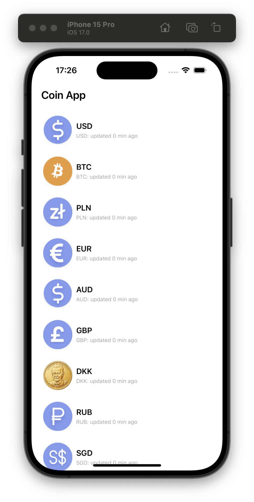
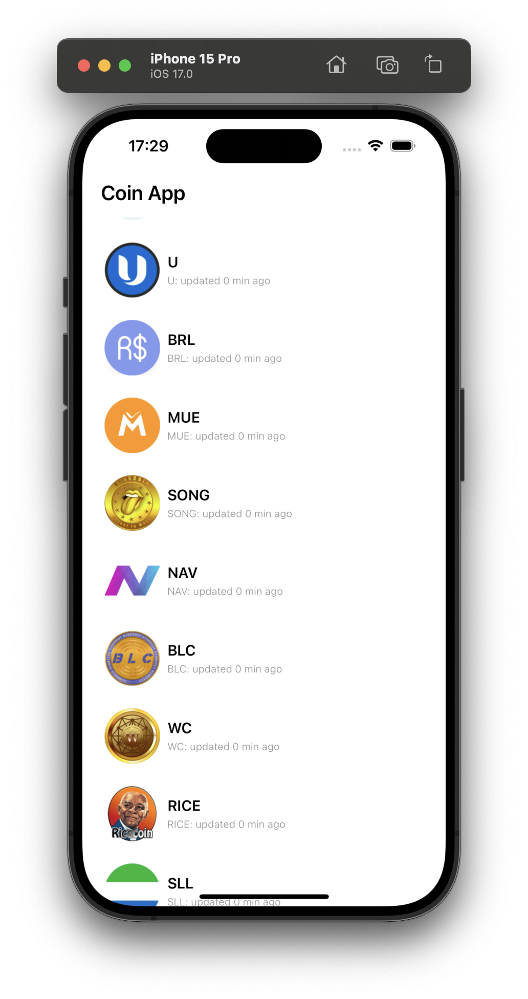

# CoinApp
A coin app displaying a list of different coins and currencies built using Swift and Swift UI. It leverages the [CoinApi](https://docs.coinapi.io/). Visit the [CoinApi](https://docs.coinapi.io/) to get your ``Api_key``


## Requirements
* ``API_KEY`` obtained from [CoinApi](https://docs.coinapi.io/)
*  XCode Version 15.0


## **Screenshots 📷**
| | |
|:-------------------------:|:-------------------------:|
| |  

## TechStack 🛠️
- [Swift](https://developer.apple.com/swift/) - Swift is a powerful and intuitive programming language for all Apple platforms. It’s easy to get started using Swift, with a concise yet expressive syntax and modern features you’ll love. Swift code is safe by design and produces software that runs lightning-fast.
- [SwiftUiI](https://developer.apple.com/documentation/swiftui/) - SwiftUI provides views, controls, and layout structures for declaring your app’s user interface. The framework provides event handlers for delivering taps, gestures, and other types of input to your app, and tools to manage the flow of data from your app’s models down to the views and controls that users see and interact with
- [URLSession](https://developer.apple.com/documentation/foundation/urlsession) - An object that coordinates a group of related, network data transfer tasks.


## License and Copyright ©️ 
[LICENSE](https://github.com/Felix-Kariuki/CoinApp/blob/main/LICENSE)

```
MIT License

Copyright (c) 2023 Felix Kariuki

Permission is hereby granted, free of charge, to any person obtaining a copy
of this software and associated documentation files (the "Software"), to deal
in the Software without restriction, including without limitation the rights
to use, copy, modify, merge, publish, distribute, sublicense, and/or sell
copies of the Software, and to permit persons to whom the Software is
furnished to do so, subject to the following conditions:

The above copyright notice and this permission notice shall be included in all
copies or substantial portions of the Software.

THE SOFTWARE IS PROVIDED "AS IS", WITHOUT WARRANTY OF ANY KIND, EXPRESS OR
IMPLIED, INCLUDING BUT NOT LIMITED TO THE WARRANTIES OF MERCHANTABILITY,
FITNESS FOR A PARTICULAR PURPOSE AND NONINFRINGEMENT. IN NO EVENT SHALL THE
AUTHORS OR COPYRIGHT HOLDERS BE LIABLE FOR ANY CLAIM, DAMAGES OR OTHER
LIABILITY, WHETHER IN AN ACTION OF CONTRACT, TORT OR OTHERWISE, ARISING FROM,
OUT OF OR IN CONNECTION WITH THE SOFTWARE OR THE USE OR OTHER DEALINGS IN THE
SOFTWARE.
```


 ## Reach Out 

  * [Twitter](https://twitter.com/felixkariuki_)

  * [LinkedIn](https://www.linkedin.com/in/felix-kariuki/)

    <a href="https://www.buymeacoffee.com/felix.kariuki" target="_blank"></a>
